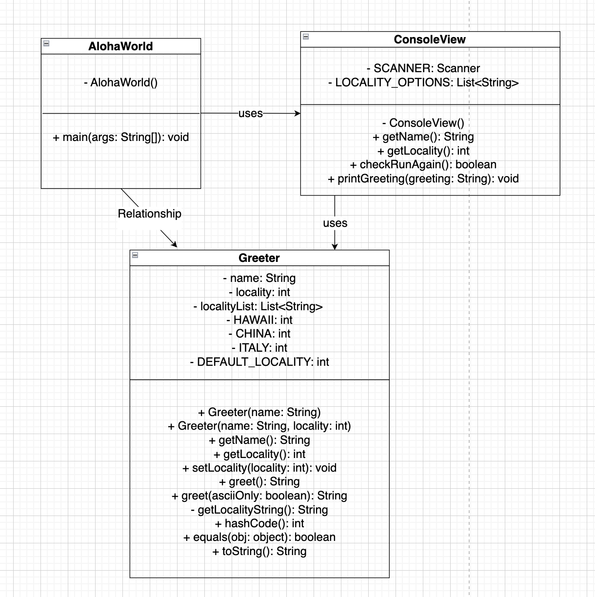

# Homework Aloha World Report

The following report contains questions you need to answer as part of your submission for the homework assignment. 

## Design Doc
Please link your UML design file here. See resources in the assignment on how to
link an image in markdown. You may also use [mermaid] class diagrams if you prefer, if so, include the mermaid code here.  You DO NOT have to include Greeting.java as part of the diagram, just the AlohaWorld application that includes: [AlohaWorld.java], [Greeter.java], and [ConsoleView.java].

### Program Flow
Write a short paragraph detailing the flow of the program in your own words. This is to help you understand / trace the code (and give you practice of something called a code walk that will be required in this course).
      
   The `AlohaWorld` class is the main entry of the program. In the main method, we prompt the user for the name and locality, and greet the user in different ways according to their locality. After greeting, the program ask if the user would like to be greeted again. If the user input "yes", then the user will be greeted again. If the user input "no", the program exits. For the new greeting, the user could change the locality and get a different greeting.
   The `ConsoleView` class is responsible for interacting with the user, including getting the user's input from the keyboard, checking if the user wants to be greeted again, and displaying the greeting.
   The `Greeter` class stores the user's information and constructs a greeting according to the user's locality.

## Assignment Questions

1. List three additional java syntax items you didn't know when reading the code.  (make sure to use * for the list items, see example below, the backtick marks are used to write code inline with markdown)

   * `Scanner SCANNER = new Scanner(System.in)`
   * `SCANNER.nextLine().trim();`
   * `List<String> localityList = List.of("Hawaii", "USA", "China", "Italy")`

2. For each syntax additional item listed above, explain what it does in your own words and then link a resource where you figured out what it does in the references section. 

    * The `Scanner` class is used for getting user's input. If we want to get users' input, we need to create an object of the Scanner class. The `System.in` will read input from the standard input stream, typically the keyboard[^1] .
    * The `nextLine()` method will read a String value from the user[^1] . The `trim()` method removes whitespaces at both ends of a string [^2] .
    * The `List.of()` method will create an immutable list with the specified elements[^3] .

3. What does `main` do in Java? 

   The `main` method is the entry point of a Java program. When we run the program, the Java Virtual Machine (JVM) will automatically call the `main` method to execute the code.

4. What does `toString()` do in Java? Why should any object class you create have a `toString()` method?

    The `toString()` method is used for converting an object to a string. We should have this method in any object class we create because we always want to print the object in a human-readable representation. Also, we may have an object act as a field in other classes and if we want to print the object in a human-readable way, we need to call the `toString()` method of that object. 

5. What is javadoc style commenting? What is it used for? 

    Javadoc style commenting is a special type of comment in Java. It is used for generating documentation for classes, constructors and methods, making it easier for other developers to read our code.

6. Describe Test Driving Development (TDD) in your own words. 

    Test Driving Development (TDD) is a methodology that we write tests first before writing the actual feature code. We use small and automated tests to guide our software development.

7. Go to the [Markdown Playground](MarkdownPlayground.md) and add at least 3 different markdown elements you learned about by reading the markdown resources listed in the document. Additionally you need to add a mermaid class diagram (of your choice does not have to follow the assignment. However, if you did use mermaid for the assignment, you can just copy that there). Add the elements into the markdown file, so that the formatting changes are reserved to that file. 

## Deeper Thinking Questions

These questions require deeper thinking of the topic. We don't expect 100% correct answers, but we encourage you to think deeply and come up with a reasonable answer. 

1. Why would we want to keep interaction with the client contained to ConsoleView?
       
      Keeping interaction with the client contained to `ConsoleView` is a way to centralize the management of the user's input and greeting output. That means we separate the user interaction logic and the greeting logic, making it easier for developers to modify the code in the future. If we need to make changes of the user interaction logic, we only need to modify the code in the `ConsoleView` class, and the other classes will not be changed.

2. Right now, the application isn't very dynamic in that it can be difficult to add new languages and greetings without modifying the code every time. Just thinking programmatically,  how could you make the application more dynamic? You are free to reference Geeting.java and how that could be used in your design.

      The `Greeting.java` allows the user to customize the greeting according to the user's nationality and languages. To add new languages and greetings more easily, we can encapsulate the languages and greetings in a new class. And in the `Greeter` class, we have a method called `greet` where we create a greeting for the user. Now, we could pass through the locality id to the new class and get the greeting information such as `asciiGreeting` and `unicodeGreeting`. Then we could construct a greeting object, passing through these greeting information to the object, then call the getFormatStr method to get the greeting.

> [!IMPORTANT]
>  After you upload the files to your github (ideally you have been committing throughout this progress / after you answer every question) - make sure to look at your completed assignment on github/in the browser! You can make sure images are showing up/formatting is correct, etc. The TAs will actually look at your assignment on github, so it is important that it is formatted correctly.

## References

[^1]: https://www.w3schools.com/java/java_user_input.asp#gsc.tab=0. Accessed: 2025-01-21. 

[^2]: https://www.w3schools.com/java/ref_string_trim.asp. Accessed: 2025-01-21.

[^3]: https://medium.com/@mgm06bm/list-of-vs-arrays-aslist-7e2f7af64361. Accessed: 2025-01-21.

<!-- This is a comment, below this link the links in the document are placed here to make ti easier to read. This is an optional style for markdown, and often as a student you will include the links inline. for example [mermaid](https://mermaid.js.org/intro/syntax-reference.html) -->
[mermaid]: https://mermaid.js.org/intro/syntax-reference.html
[AlohaWorld.java]: src/main/java/student/AlohaWorld.java
[Greeter.java]: src/main/java/student/Greeter.java
[ConsoleView.java]: src/main/java/student/ConsoleView.java